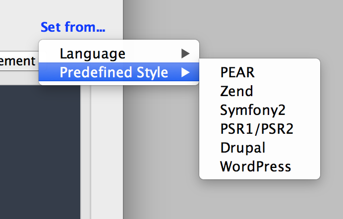

# PhpStorm Laravel Code Style

This is a code style based on PSR-2, as per Laravel's [Contribution Guide](http://laravel.com/docs/5.1/contributions#coding-style)

To use this coding style, drop the `Laravel.xml` file in the `/config/codestyles/` subfolder within your [configuration directory](https://www.jetbrains.com/phpstorm/help/project-and-ide-settings.html).

This code style has been updated in line with Laravel 5.1, but the minor customisations used previously have been removed.

Alternatively, you can use PhpStorm's built in Code Styles to set from the predefined PSR1/PSR2 style. This can be found in `Preferences > Editor > Code Style > PHP`.

